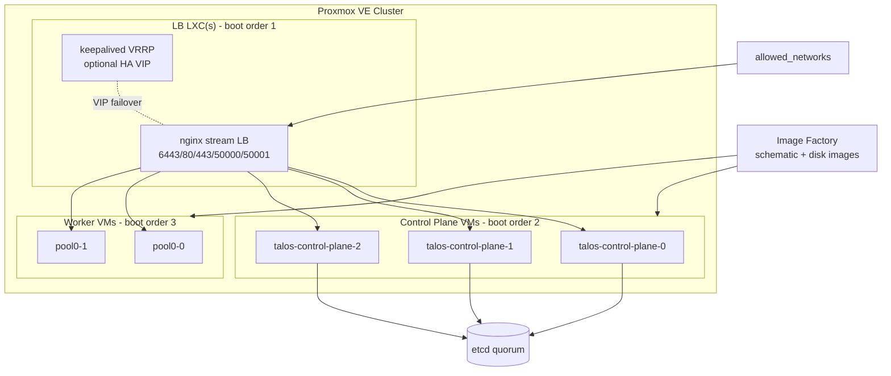

# terraform-proxmox-talos-multi-node

A module for spinning up an expandable and flexible Talos server for your HomeLab in a multinode Proxmox cluster.

## Features
- Fully automated. No need to remote into a VM; even for a kubeconfig
- Built in and automatically configured external loadbalancer (both K8s API and ingress)
- Node pools to easily scale and to handle many kinds of workloads
- Master nodes with custom topology for your use cases.
- Pure Terraform - no Ansible needed.
- Support to add and automatically format additional storage for use with tools like Longhorn.

## Prerequisites
- Proxmox node(s) running 8.2 or higher
- Proxmox nodes with sufficient capacity for all nodes
- SSH Keys copied to nodes that will have Talos Cluster created. Needed for image downloads and conversion.
- At least 2 CIDR ranges for master and worker nodes NOT handed out by DHCP (All Nodes are configured with static IPs from these ranges)

## The BPG Provider does certain functions that require SSH on each Proxmox node your SSH private key will need to be copied.
```sh
# On deployer VM or system.
ssh-copy-id -i ~/.ssh/id_ed25519.pub root@10.0.5.0
```


## Usage and Example

A complete, working configuration lives in [`example/main.tf`](example/main.tf) with a
copy-paste variable file at [`example/terraform.tfvars.example`](example/terraform.tfvars.example).

Minimal usage:

```terraform
provider "proxmox" {
  # Authenticate via the PM_USER / PM_PASS or PM_API_TOKEN_ID / PM_API_TOKEN_SECRET
  # environment variables. Verify TLS with the PVE CA (/etc/pve/pve-root-ca.pem)
  # instead of using `insecure = true`:
  endpoint           = "https://10.0.5.0:8006/"
  tls_ca_certificate = file("pve-root-ca.pem")

  ssh {
    agent       = true
    username    = "root"
    private_key = file("~/.ssh/id_ed25519")
  }
}

module "talos" {
  source              = "git::https://github.com/dellathefella/terraform-proxmox-talos-multinode.git"
  cluster_name        = "homelab"
  network_gateway     = "10.0.0.1"
  lan_subnet          = "10.0.0.0/24"
  control_plane_subnet = "10.0.6.0/29"

  # Only these networks may reach the LB ports (6443, 80, 443, 50000/50001, ...).
  allowed_networks = ["10.0.0.0/24"]

  control_plane_nodes = [
    # 3 nodes recommended (etcd quorum) - see example/main.tf
  ]

  node_pools = [
    # see example/main.tf; supports optional `additional_storage` per pool
  ]
}

output "kube_config" {
  value     = module.talos.kube_config
  sensitive = true
}
```

Finally output the config file:

```sh
# Test out the config:
terraform output -raw kube_config > config.yaml && kubectl --kubeconfig config.yaml get nodes
kubectl --kubeconfig config.yaml get nodes
```


> Make sure your support node is routable from the computer you are running the command on!

## GitOps (Flux + Longhorn)

This module deliberately does **not** bake Longhorn or Flux into the machine
configuration (no more multi-hundred-KB `inlineManifests`). The cluster bootstraps
bare and you install everything through GitOps after bootstrap:

```sh
# 1. Bootstrap Flux against your own git repo
flux bootstrap github \
  --owner=<your-github-org> \
  --repository=homelab-clusters \
  --path=clusters/<cluster_name> \
  --personal

# 2. Add Longhorn as a HelmRelease in that repo, e.g.:
#    helmRepository + helmRelease for longhorn (https://charts.longhorn.io)
#    with: defaultSettings.defaultDataPath=/var/mnt/longhorn
#    and the longhorn-system namespace labeled:
#      pod-security.kubernetes.io/enforce=privileged
```

Workers configured with `additional_storage` get a second disk (`virtio1`) that
Talos provisions via `UserVolumeConfig` and mounts at `/var/mnt/longhorn`, which
is the data path Longhorn should be pointed at.

## Architecture



## IP Addressing

All nodes receive static IPs computed with `cidrhost()` from the subnets you provide.
Index `0` of any subnet is the network address and is never assigned:

| Subnet | Index | Assigned to |
| --- | --- | --- |
| `control_plane_subnet` | `.1` | Cluster LB LXC (API endpoint + ingress LB) |
| `control_plane_subnet` | `.2` | Secondary LB LXC (only when `lb_ha_enabled = true`) |
| `control_plane_subnet` | `.2` / `.3` - `.(N+2)` | Control plane nodes (in list order; offset shifts by 1 with HA) |
| each pool `subnet` | `.1` - `.size` | Worker nodes (in pool order) |

Example with `control_plane_subnet = "10.0.6.0/29"` and 3 control planes:
LB gets `10.0.6.1`, control planes get `10.0.6.2` - `10.0.6.4`.
With `lb_ha_enabled = true`: LB `.1`, secondary LB `.2`, control planes `10.0.6.3` - `10.0.6.5`,
and the API endpoint becomes the user-supplied `lb_vip`.

## Migrating from a pre-refactor state

If you are upgrading an existing deployment, resource addresses have moved into
submodules. Run these **before** `tofu apply` (adjust node names to match your
state):

```sh
# Image downloads moved to the new resource type
tofu state mv 'proxmox_virtual_environment_download_file.talos_image["pve0"]' 'proxmox_download_file.talos_image["pve0"]'
tofu state mv 'proxmox_virtual_environment_download_file.latest_ubuntu_24_noble_lxc_img' 'module.lb.proxmox_download_file.latest_ubuntu_24_noble_lxc_img["pve0"]'

# Resources moved into submodules
tofu state mv 'proxmox_virtual_environment_container.cluster_lb' 'module.lb.proxmox_virtual_environment_container.cluster_lb["primary"]'
tofu state mv 'random_password.cluster_lb_lxc_password' 'module.lb.random_password.cluster_lb_lxc_password'
tofu state mv 'null_resource.talos_nginx_install' 'module.lb.null_resource.talos_nginx_install["primary"]'
tofu state mv 'null_resource.talos_nginx_config' 'module.lb.null_resource.talos_nginx_config["primary"]'
tofu state mv 'proxmox_virtual_environment_vm.talos_control_plane["<name>"]' 'module.control_plane.proxmox_virtual_environment_vm.vm["<name>"]'   # per node
tofu state mv 'proxmox_virtual_environment_vm.talos_worker["<key>"]' 'module.workers.proxmox_virtual_environment_vm.vm["<key>"]'             # per node
tofu state mv 'talos_machine_secrets.cluster_machine_secret' 'module.talos.talos_machine_secrets.cluster_machine_secret'
tofu state mv 'talos_machine_configuration_apply.control_plane["<name>"]' 'module.talos.talos_machine_configuration_apply.control_plane["<name>"]'
tofu state mv 'talos_machine_configuration_apply.worker["<key>"]' 'module.talos.talos_machine_configuration_apply.worker["<key>"]'
tofu state mv 'talos_machine_bootstrap.control_plane' 'module.talos.talos_machine_bootstrap.control_plane'
tofu state mv 'talos_cluster_kubeconfig.cluster_kubeconfig' 'module.talos.talos_cluster_kubeconfig.cluster_kubeconfig'
```

Note: the IP addressing fix (network-address bug) changes the IPs of the LB LXC
and all nodes, which **forces replacement** of those resources. Plan a
maintenance window or rebuild the cluster from scratch when applying this change.
`install_disk` was also renamed to `install_disks` (now a list, enabling mirrored
system-disk installs).

## Runbooks

- [How to roll (update) your nodes](docs/roll-node-pools.md)
- [Talos & Kubernetes upgrades](docs/upgrade.md)
- [Certificate lifecycle & rotation](docs/certificates.md)
- [Releasing this module](docs/RELEASING.md)

## Why use nodepools and subnets?

This module is designed with nodepools and subnets to allow for changes to the
cluster composition in the future. If later on, you want to add another master
or worker node, you can do so without needing to teardown/modify existing
nodes. Nodepools are key if you plan to support nodes with different nodepool
capabilities in the future without impacting other nodes.

<!-- BEGIN_TF_DOCS -->
## Requirements

| Name | Version |
| ---- | ------- |
| <a name="requirement_terraform"></a> [terraform](#requirement\_terraform) | >= 1.5.0 |
| <a name="requirement_proxmox"></a> [proxmox](#requirement\_proxmox) | ~> 0.113.0 |
| <a name="requirement_talos"></a> [talos](#requirement\_talos) | ~> 0.11.0 |

## Providers

| Name | Version |
| ---- | ------- |
| <a name="provider_proxmox"></a> [proxmox](#provider\_proxmox) | 0.113.1 |
| <a name="provider_talos"></a> [talos](#provider\_talos) | 0.11.0 |

## Modules

| Name | Source | Version |
| ---- | ------ | ------- |
| <a name="module_control_plane"></a> [control\_plane](#module\_control\_plane) | ./modules/control_plane | n/a |
| <a name="module_lb"></a> [lb](#module\_lb) | ./modules/lb | n/a |
| <a name="module_talos"></a> [talos](#module\_talos) | ./modules/talos | n/a |
| <a name="module_workers"></a> [workers](#module\_workers) | ./modules/workers | n/a |

## Resources

| Name | Type |
| ---- | ---- |
| [proxmox_backup_job.cluster_backup](https://registry.terraform.io/providers/bpg/proxmox/latest/docs/resources/backup_job) | resource |
| [proxmox_download_file.talos_image](https://registry.terraform.io/providers/bpg/proxmox/latest/docs/resources/download_file) | resource |
| [proxmox_pool_membership.cluster_members](https://registry.terraform.io/providers/bpg/proxmox/latest/docs/resources/pool_membership) | resource |
| [proxmox_virtual_environment_pool.cluster_pool](https://registry.terraform.io/providers/bpg/proxmox/latest/docs/resources/virtual_environment_pool) | resource |
| [talos_image_factory_schematic.this](https://registry.terraform.io/providers/siderolabs/talos/latest/docs/resources/image_factory_schematic) | resource |
| [talos_image_factory_urls.talos_image](https://registry.terraform.io/providers/siderolabs/talos/latest/docs/data-sources/image_factory_urls) | data source |

## Inputs

| Name | Description | Type | Default | Required |
| ---- | ----------- | ---- | ------- | :------: |
| <a name="input_allowed_networks"></a> [allowed\_networks](#input\_allowed\_networks) | CIDR ranges allowed to reach the cluster load balancer ports (6443, 80, 443, 50000/50001 and any additional ports). | `list(string)` | <pre>[<br/>  "0.0.0.0/0"<br/>]</pre> | no |
| <a name="input_api_hostnames"></a> [api\_hostnames](#input\_api\_hostnames) | Alternative hostnames for the API server. | `list(string)` | `[]` | no |
| <a name="input_authorized_keys_file"></a> [authorized\_keys\_file](#input\_authorized\_keys\_file) | Path to file containing public SSH keys for remoting into nodes. | `string` | `"~/.ssh/id_ed25519.pub"` | no |
| <a name="input_authorized_private_key_file"></a> [authorized\_private\_key\_file](#input\_authorized\_private\_key\_file) | Path to file containing private SSH keys for remoting into nodes. | `string` | `"~/.ssh/id_ed25519"` | no |
| <a name="input_backup_schedule"></a> [backup\_schedule](#input\_backup\_schedule) | Backup schedule in systemd calendar-event format (requires pbs\_datastore\_id). | `string` | `"*-*-* 03:00"` | no |
| <a name="input_cluster_lb_lxc_settings"></a> [cluster\_lb\_lxc\_settings](#input\_cluster\_lb\_lxc\_settings) | Default settings values for cluster LB LXC | <pre>object({<br/>    node_name                              = string,<br/>    cores                                  = number,<br/>    memory                                 = number,<br/>    datastore_id                           = string,<br/>    disk_size                              = number,<br/>    network_bridge                         = string,<br/>    additional_lb_worker_node_ports        = optional(list(number), [])<br/>    additional_lb_control_plane_node_ports = optional(list(number), [])<br/>    nginx_worker_connections               = optional(number, 768)<br/>  })</pre> | <pre>{<br/>  "additional_lb_control_plane_node_ports": [],<br/>  "additional_lb_worker_node_ports": [],<br/>  "cores": 2,<br/>  "datastore_id": "local-lvm",<br/>  "disk_size": 4,<br/>  "memory": 512,<br/>  "network_bridge": "vmbr0",<br/>  "nginx_worker_connections": 768,<br/>  "node_name": "pve"<br/>}</pre> | no |
| <a name="input_cluster_name"></a> [cluster\_name](#input\_cluster\_name) | Name of the cluster used for prefixing cluster components (ie nodes). | `string` | `"talos"` | no |
| <a name="input_control_plane_nodes"></a> [control\_plane\_nodes](#input\_control\_plane\_nodes) | Control plane nodes. Use an odd count (1, 3, 5) for etcd quorum. | <pre>list(object({<br/>    node_name            = string,<br/>    cores                = number,<br/>    memory               = number,<br/>    datastore_id         = string,<br/>    disk_size            = number,<br/>    network_bridge       = string,<br/>    install_disks        = optional(list(string), ["/dev/sda"])<br/>    extra_config_patches = optional(list(string), [])<br/>  }))</pre> | n/a | yes |
| <a name="input_control_plane_subnet"></a> [control\_plane\_subnet](#input\_control\_plane\_subnet) | CIDR range used for the cluster LB LXC (.1) and control plane nodes (.2+). The network address (.0) is never assigned. | `string` | n/a | yes |
| <a name="input_create_pve_pool"></a> [create\_pve\_pool](#input\_create\_pve\_pool) | Create a Proxmox pool named after the cluster and add all cluster VMs/LXCs to it (UI grouping, ACLs, backup scoping). | `bool` | `true` | no |
| <a name="input_http_proxy"></a> [http\_proxy](#input\_http\_proxy) | HTTP(S) proxy URL used when installing packages on the load balancer LXC. | `string` | `""` | no |
| <a name="input_lan_subnet"></a> [lan\_subnet](#input\_lan\_subnet) | Subnet used by the LAN network. Note that only the bit count number at the end<br/>is acutally used, and all other subnets provided are secondary subnets. | `string` | n/a | yes |
| <a name="input_lb_firewall_enabled"></a> [lb\_firewall\_enabled](#input\_lb\_firewall\_enabled) | Enable the Proxmox firewall on the load balancer LXC(s): default-deny inbound with only allowed\_networks permitted. | `bool` | `false` | no |
| <a name="input_lb_ha_enabled"></a> [lb\_ha\_enabled](#input\_lb\_ha\_enabled) | Deploy a second load balancer LXC with keepalived (VRRP) so the cluster API endpoint survives a single LB failure. The secondary LB takes .2 of control\_plane\_subnet and control plane nodes shift to .3+. | `bool` | `false` | no |
| <a name="input_lb_secondary_node_name"></a> [lb\_secondary\_node\_name](#input\_lb\_secondary\_node\_name) | Proxmox node for the secondary LB LXC. Defaults to the primary LB node. | `string` | `null` | no |
| <a name="input_lb_vip"></a> [lb\_vip](#input\_lb\_vip) | Virtual (VRRP) IP address for the highly available load balancer endpoint. Required when lb\_ha\_enabled is true; must be a free address on the LAN. | `string` | `""` | no |
| <a name="input_lb_vrrp_router_id"></a> [lb\_vrrp\_router\_id](#input\_lb\_vrrp\_router\_id) | VRRP virtual router ID for the HA load balancer. Must be unique per L2 segment. | `number` | `51` | no |
| <a name="input_network_gateway"></a> [network\_gateway](#input\_network\_gateway) | IP address of the network gateway. | `string` | n/a | yes |
| <a name="input_node_pools"></a> [node\_pools](#input\_node\_pools) | Node pool definitions for the cluster. | <pre>list(object({<br/>    size      = number,<br/>    subnet    = string,<br/>    node_name = string,<br/>    node_pool_settings = object({<br/>      name           = string,<br/>      taints         = optional(list(string), []),<br/>      cores          = number,<br/>      memory         = number,<br/>      datastore_id   = string,<br/>      install_disks  = optional(list(string), ["/dev/sda"])<br/>      disk_size      = number,<br/>      network_bridge = string,<br/>      additional_storage = optional(object({<br/>        datastore_id = string,<br/>        disk_size    = number,<br/>      }), null)<br/>      extra_config_patches = optional(list(string), [])<br/>    })<br/>  }))</pre> | n/a | yes |
| <a name="input_pbs_datastore_id"></a> [pbs\_datastore\_id](#input\_pbs\_datastore\_id) | Proxmox Backup Server datastore ID. When set, a nightly backup job for the cluster pool is created. | `string` | `null` | no |
| <a name="input_talos_arch"></a> [talos\_arch](#input\_talos\_arch) | CPU architecture of the Talos images (amd64 or arm64). | `string` | `"amd64"` | no |
| <a name="input_talos_version"></a> [talos\_version](#input\_talos\_version) | Talos version to install (must be available on the Talos Image Factory). | `string` | `"v1.14.1"` | no |

## Outputs

| Name | Description |
| ---- | ----------- |
| <a name="output_cluster_api_endpoint"></a> [cluster\_api\_endpoint](#output\_cluster\_api\_endpoint) | The address the cluster API and ingress are reachable at (VIP when HA, primary LB otherwise). |
| <a name="output_cluster_lb_lxc_ip"></a> [cluster\_lb\_lxc\_ip](#output\_cluster\_lb\_lxc\_ip) | n/a |
| <a name="output_cluster_lb_lxc_user"></a> [cluster\_lb\_lxc\_user](#output\_cluster\_lb\_lxc\_user) | n/a |
| <a name="output_kube_config"></a> [kube\_config](#output\_kube\_config) | Kubernetes configuration file |
| <a name="output_talos_control_plane_ips"></a> [talos\_control\_plane\_ips](#output\_talos\_control\_plane\_ips) | n/a |
| <a name="output_talos_schematic_id"></a> [talos\_schematic\_id](#output\_talos\_schematic\_id) | Image Factory schematic ID used for the Talos disk images. |
| <a name="output_talos_version"></a> [talos\_version](#output\_talos\_version) | Talos version installed on all nodes. |
| <a name="output_talos_worker_ips"></a> [talos\_worker\_ips](#output\_talos\_worker\_ips) | IP addresses of all worker nodes across all pools. |
| <a name="output_talosconfig_path"></a> [talosconfig\_path](#output\_talosconfig\_path) | Path to the talosconfig file (kept out of Terraform state; regenerate with `tofu apply`). |
| <a name="output_worker_ips_by_pool"></a> [worker\_ips\_by\_pool](#output\_worker\_ips\_by\_pool) | Worker node IP addresses grouped by node pool name. |
<!-- END_TF_DOCS -->